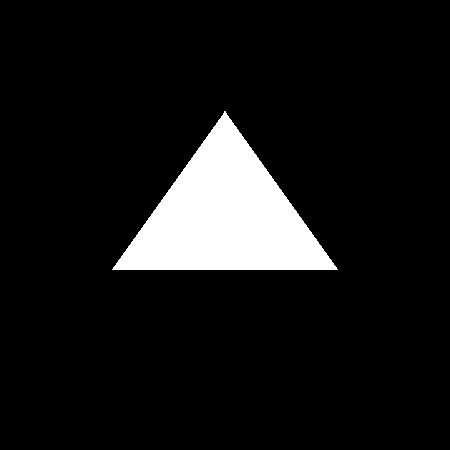
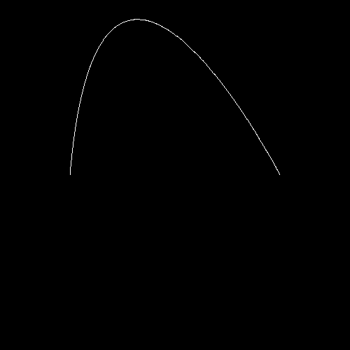

# Python project implementing Graphics API

## Raster.py

In this file we have the basics on plotting 2D images, converting primitives into pixelmap.

    

        
Rendered Slope

        
    

    

        
Filled Polygon

        
    

    

        
Hermite Spline with 100 Points resolution

        
    

## Wireframes

# References

1. [2D Primitives (PT-BR)](https://www.facom.ufu.br/~abdala/GBC204/03_primitivas2D.pdf)
1. [3D Modeling (PT-BR)](https://www.inf.pucrs.br/~pinho/CG/Aulas/Modelagem/Modelagem3D.htm)
1. [3D Representation (PT-BR), Page 26-31, 33-40](https://www.inf.pucrs.br/~smusse/CG/PDF2013_2/Representacao.pdf)
1. [Project Points (EN)](https://www.baeldung.com/cs/3d-point-2d-plane)